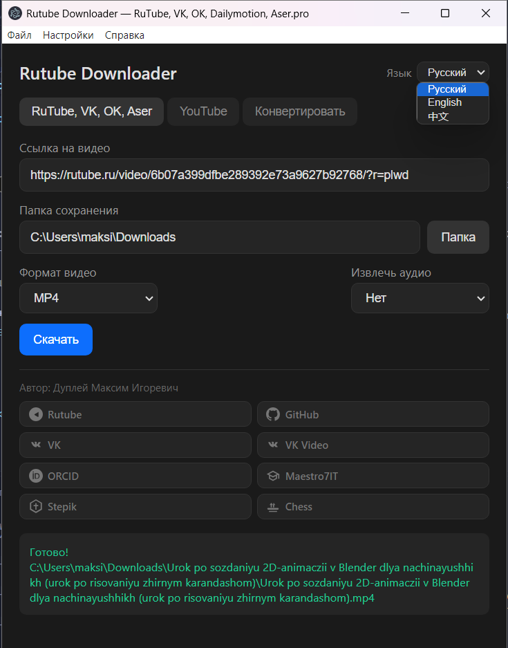
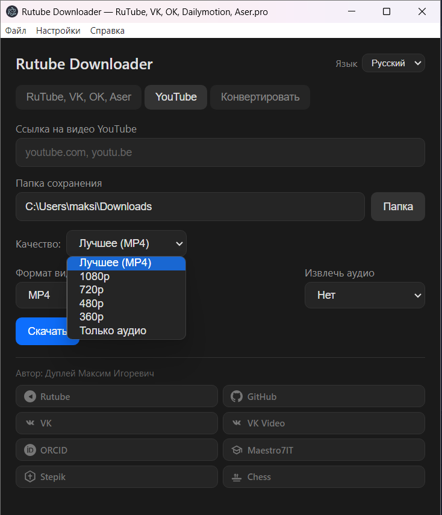

# Rutube Downloader

**Автор:** Дуплей Максим Игоревич  
**Дата:** 04.07.2026  
**Школа программирования:** Maestro7IT

---

Форк [ProjectSoft-STUDIONIONS/rutube-downloader](https://github.com/ProjectSoft-STUDIONIONS/rutube-downloader). Десктопное приложение и CLI для скачивания видео с **YouTube**, RuTube, VK Video, OK.ru, Aser.pro.





---

## Возможности

- Скачивание видео с **YouTube**, **RuTube**, **VK Video**, **OK.ru**, **Aser.pro**
- Выбор качества видео (для YouTube: best, 1080p, 720p, 480p, 360p, только аудио)
- Параллельная загрузка сегментов (по умолчанию 5 потоков)
- Автоматическая конвертация TS в MP4 через FFmpeg
- Извлечение аудио из видео в форматы **MP3**, **WAV**, **FLAC**
- Вкладка конвертации для преобразования видеофайлов между форматами
- Тёмный интерфейс с вкладками для разных площадок
- Прогресс загрузки в реальном времени

## Поддерживаемые сайты

| Сайт | Пример URL |
|------|-----------|
| YouTube | `youtube.com/watch?v=...`, `youtu.be/...` |
| RuTube | `rutube.ru/video/...` |
| VK Video | `vkvideo.ru/video...`, `vkvideo.ru/live-...`, `vk.com/video...`, `vk.com/live-...` |
| OK.ru | `ok.ru/video/...` |
| Aser.pro | `aser.pro/content/.../hls/index.m3u8` |

## Запуск приложения (окно)

```bash
npm install
npm start
```

Откроется окно: выберите вкладку (**RuTube, VK, OK, Aser** или **YouTube**), вставьте ссылку, укажите папку сохранения, для YouTube — при необходимости выберите качество, нажмите **Скачать**.

Сборка установщика: `npm run build` (результат в `dist/`).

Нужен **FFmpeg** в PATH (на Windows в комплекте есть `bin/ffmpeg.exe`). Для YouTube при первом запуске подтягивается **yt-dlp** (через `youtube-dl-exec`).

## CLI

```bash
node index.js <ссылка на видео>
```

### Опции CLI

| Опция | Описание |
|-------|---------|
| `-t <заголовок>` | Указать имя файла вручную |
| `-p <число>` | Количество параллельных загрузок (по умолчанию 5) |
| `-q` | Интерактивный выбор качества |
| `-h` | Показать справку |

Пример:

```bash
node index.js -p 8 "https://rutube.ru/video/abc123/"
```

Поддерживаются несколько ссылок подряд.

## Технологии

- **Electron 28** — десктопное приложение
- **Node.js** — рантайм для CLI и ядра загрузки
- **FFmpeg** — конвертация TS → MP4, извлечение аудио (MP3/WAV/FLAC)
- **yt-dlp** — загрузка видео с YouTube
- **m3u8-parser** — парсинг HLS-плейлистов
- **node-fetch** — HTTP-запросы
- **split-file** — объединение сегментов
- **cli-progress** — прогресс-бар в CLI

## Структура проекта

```
rutube-downloader/
├── app/                  # Electron GUI (main.js, index.html, preload.js)
├── bin/                  # Бинарники (ffmpeg.exe)
├── src/
│   ├── videoProviders/   # Плагины загрузчиков (YouTube, RuTube, VK, OK, Aser)
│   ├── downloadFile.js   # Скачивание сегментов + объединение + конвертация
│   ├── FFmpeg.js         # Обёртка над FFmpeg
│   ├── m3u8Utils.js      # Парсинг HLS m3u8
│   ├── parallelFor.js    # Параллельное выполнение
│   └── ...
├── index.js              # Точка входа CLI
├── package.json
└── README.md
```

## Лицензия

MIT License
