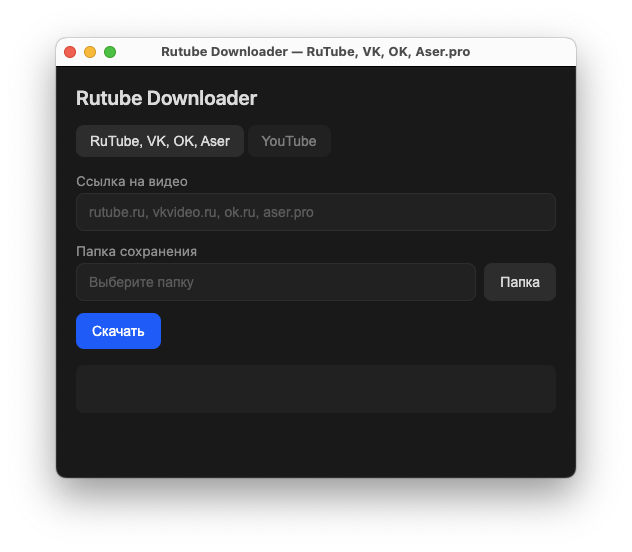
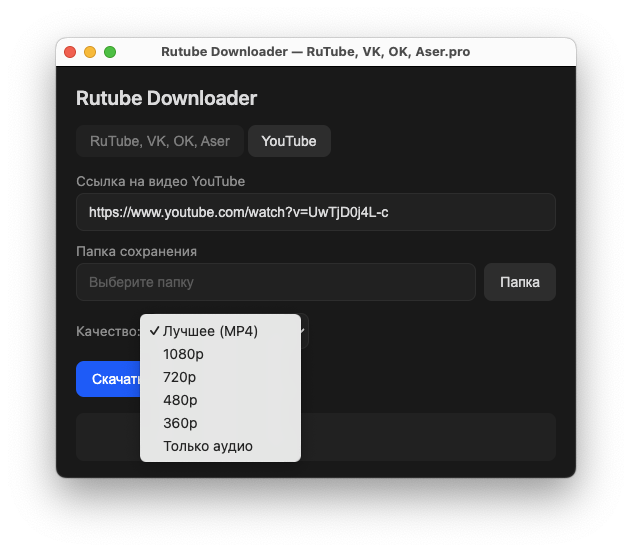

# Rutube Downloader

Форк [ProjectSoft-STUDIONIONS/rutube-downloader](https://github.com/ProjectSoft-STUDIONIONS/rutube-downloader). Десктопное приложение и CLI для скачивания видео с **YouTube**, RuTube, VK Video, OK.ru, Aser.pro.





---

## Запуск приложения (окно)

```bash
npm install
npm start
```

Откроется окно: выберите вкладку (**RuTube, VK, OK, Aser** или **YouTube**), вставьте ссылку, укажите папку сохранения, для YouTube — при необходимости выберите качество, нажмите **Скачать**.

Сборка установщика: `npm run build` (результат в `dist/`).

Нужен **FFmpeg** в PATH (на Windows в комплекте есть `bin/ffmpeg.exe`). Для YouTube при первом запуске подтягивается **yt-dlp** (через `youtube-dl-exec`).

## CLI

```bash
node index.js <ссылка на видео>
```

Поддерживаются несколько ссылок подряд. Скрипт предложит выбрать качество; по умолчанию загрузка в 5 потоков (опция `-p <число>`).

## Поддерживаемые сайты

`youtube.com`, `youtu.be`, `rutube.ru`, `vkvideo.ru`, `ok.ru`, `aser.pro`
